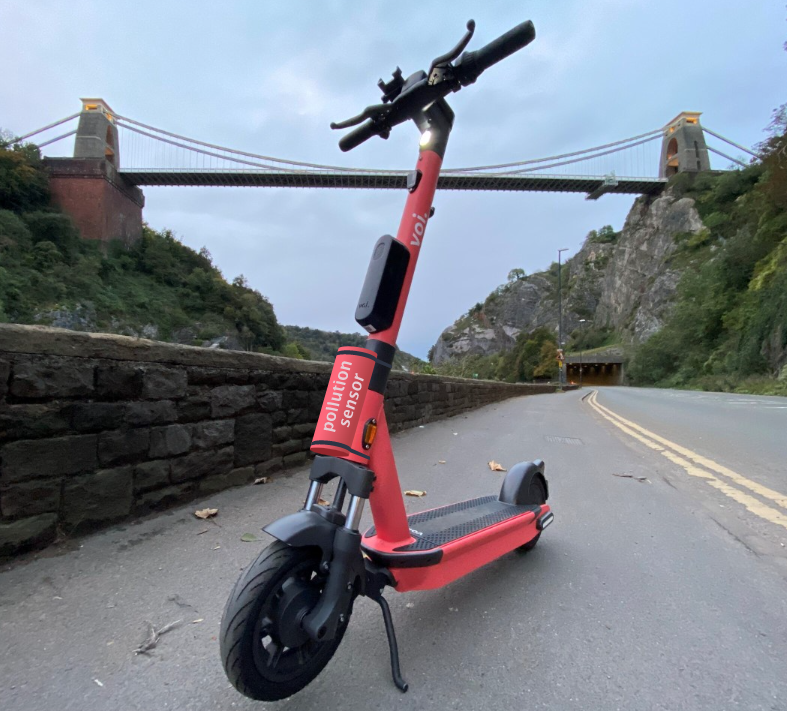

Thank you for your interest in our project. You can register to take part below.
{.banner}

The [University of Bristol](https://www.bristol.ac.uk/golding/) has teamed up with [Voi](https://www.voi.com/) and [West of England Combined Authority](https://www.westofengland-ca.gov.uk/) to try to better understand pollution in Bristol.

We have designed a pollution sensor integrates with Voi e-scooters, collecting pollution data as the vehicle is ridden around.

We are looking for volunteers who use a Voi e-scooter on a _long term rental_. If selected, you will be among the __first people to test the pollution sensor__ on your long term rental scooter.

The sensor will be installed for up to 6 months, during which time it will collect pollution data from the places you visit and the routes you take.

At the end of the project you can __find out about your own pollution exposure levels__, which of the places you went to were the cleanest, and which might be best to avoid in future.

# What next?

At this stage, we are collecting expression of interest from long term rental users.

[Register your interest to take part](https://forms.office.com/e/tqYs3f14ds){.btn .btn-primary target=_blank}

Don't worry, you will have the opportunity to ask further questions and are not committing to anything at this stage.
